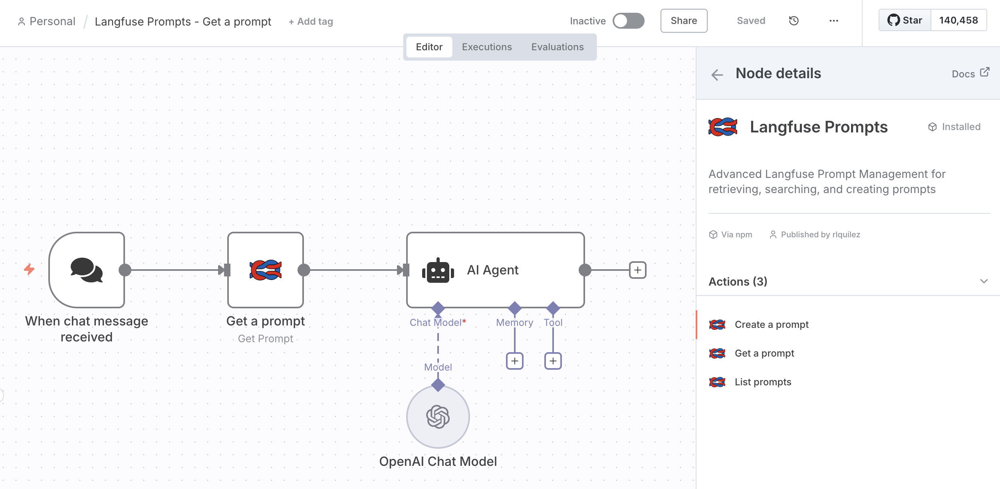
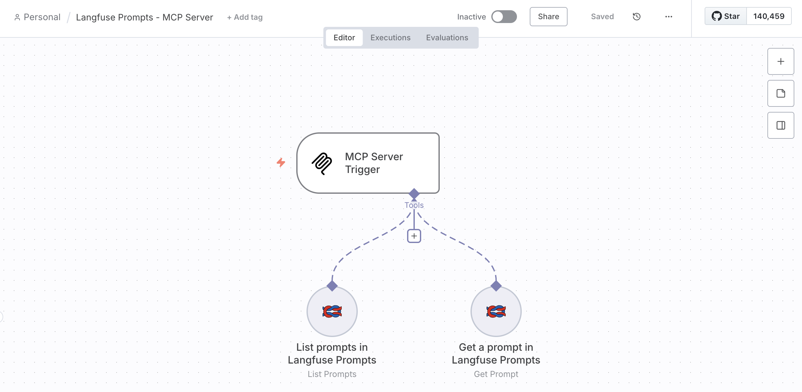

# n8n-nodes-langfuse-prompt

Enhanced Langfuse integration for n8n with advanced Prompt Management capabilities.

[](https://www.npmjs.com/package/n8n-nodes-langfuse-prompt)
[](https://opensource.org/licenses/MIT)
[](https://docs.n8n.io/integrations/community-nodes/)

## Table of Contents

- [Features](#features)
- [Installation](#installation)
- [MCP Server Integration](#mcp-server-integration)
- [Credentials Setup](#credentials-setup)
- [Operations](#operations)
- [Usage Examples](#usage-examples)
- [Docker Setup](#docker-setup)
- [Development](#development)
- [Troubleshooting](#troubleshooting)
- [License](#license)

## Features

### Comprehensive Prompt Management
- **Get Prompt**: Retrieve specific prompts by name, version, or label
- **List Prompts**: Browse and search all prompts with advanced filtering
- **Create Prompt**: Create new text or chat prompts directly from n8n workflows

### Advanced Search Capabilities
- **Filter by Name**: Exact match filtering by prompt name
- **Smart Filtering**: Filter by tags, labels, and versions
- **Pagination Support**: Handle large prompt collections efficiently

### Modern Integration Features
- **MCP Server Compatible**: Works as a tool in Model Context Protocol workflows
- **Version Control**: Retrieve specific prompt versions and create new versions
- **Bulk Operations**: Process multiple prompts efficiently
- **Type Support**: Handle both text and chat-style prompts



## Installation

### Method 1: Community Nodes (Recommended)

For n8n v0.187+, install directly from the UI:

1. Go to **Settings → Community Nodes**
2. Click **Install**
3. Enter `n8n-nodes-langfuse-prompt`
4. Click **Install**

### Method 2: Manual Installation

```bash
# Navigate to your n8n installation directory
cd ~/.n8n

# Install the package
npm install n8n-nodes-langfuse-prompt

# Restart n8n
```

### Method 3: Docker

Add to your docker-compose.yml:

```yaml
environment:
  N8N_NODES_INCLUDE: "n8n-nodes-langfuse-prompt"
```

## MCP Server Integration

This node supports **Model Context Protocol (MCP)**, enabling AI agents to interact directly with Langfuse prompts in n8n workflows.



### MCP Features
- **Tool Integration**: AI agents can use this node as a tool
- **Dynamic Access**: Agents can retrieve, search, and create prompts
- **Workflow Automation**: Seamless integration with n8n's MCP Server Trigger

### MCP Usage Example

```javascript
// AI agent can call:
{
  "operation": "get",
  "promptName": "customer-support-prompt",
  "label": "production"
}

// Or filter prompts:
{
  "operation": "list",
  "nameFilter": "customer-support",
  "labelFilter": "production"
}
```

## Credentials Setup

Create a **Langfuse API** credential with:

- **Base URL**: Your Langfuse instance (e.g., https://cloud.langfuse.com)
- **Public Key**: Your Langfuse public key  
- **Secret Key**: Your Langfuse secret key

Find your API keys in Langfuse project settings.

## Operations

### Get Prompt

Retrieve a specific prompt by name.

**Required Parameters:**
- promptName: The prompt name

**Optional Parameters:**
- label: Version label (e.g., "production")
- version: Specific version number

### List Prompts

Browse and filter your prompts using Langfuse API v2 parameters.

**Optional Parameters:**
- nameFilter: Filter by exact prompt name match
- tagFilter: Filter by specific tag
- labelFilter: Filter by specific label
- versionFilter: Filter by version number
- page: Page number for pagination  
- limit: Items per page (1-100, default 50)

### Create Prompt

Create new text or chat prompts.

**Required Parameters:**
- createPromptName: Unique prompt name
- promptType: "text" or "chat"
- promptContent: Content for text prompts
- chatMessages: JSON array for chat prompts

**Optional Parameters:**
- labels: Comma-separated labels
- tags: Comma-separated tags
- config: JSON configuration object
- commitMessage: Version commit message

## Usage Examples

### Example 1: Get a Production Prompt

```json
{
  "operation": "get",
  "promptName": "customer-service-template",
  "label": "production"
}
```

### Example 2: Filter Prompts by Tag

```json
{
  "operation": "list", 
  "tagFilter": "customer-support",
  "labelFilter": "production",
  "limit": 10
}
```

### Example 3: Create a Chat Prompt

```json
{
  "operation": "create",
  "createPromptName": "support-agent-v2",
  "promptType": "chat",
  "chatMessages": [
    {
      "role": "system", 
      "content": "You are a helpful customer support agent..."
    },
    {
      "role": "user",
      "content": "{{customer_question}}"
    }
  ],
  "labels": "production,support",
  "tags": "customer-service,chat"
}
```

### Example 4: Filter by Tags and Date

```json
{
  "operation": "list",
  "tagFilter": "production",
  "limit": 20,
  "page": 1
}
```

## Docker Setup

### Option 1: Environment Variable

```dockerfile
FROM n8nio/n8n:latest
ENV N8N_NODES_INCLUDE=n8n-nodes-langfuse-prompt
```

### Option 2: Docker Compose

```yaml
version: '3.8'
services:
  n8n:
    image: n8nio/n8n:latest
    environment:
      - N8N_NODES_INCLUDE=n8n-nodes-langfuse-prompt
    ports:
      - "5678:5678"
    volumes:
      - n8n_data:/home/node/.n8n
volumes:
  n8n_data:
```

### Option 3: Custom Build

```dockerfile
FROM n8nio/n8n:latest
USER root
RUN npm install -g n8n-nodes-langfuse-prompt
USER node
ENV N8N_NODES_INCLUDE=n8n-nodes-langfuse-prompt
```

## Development

### Prerequisites
- Node.js 16+
- n8n CLI: npm install -g n8n

### Setup
```bash
git clone https://github.com/rlquilez/n8n-nodes-langfuse-prompt.git
cd n8n-nodes-langfuse-prompt
npm install
npm run build
npm link
```

### Testing
```bash
# In your n8n directory
npm link n8n-nodes-langfuse-prompt
n8n start
```

## Troubleshooting

### Common Issues

**Node not appearing?**
- Restart n8n completely
- Check n8n version compatibility
- Verify package installation

**Filtering not working?**
- Ensure filter parameters are correctly formatted
- Check that values match exactly (especially for name filter)  
- Verify Langfuse instance version compatibility

**API connection issues?**
- Verify Langfuse credentials
- Check instance URL accessibility
- Ensure API keys have proper permissions

### Getting Help
- Check [Issues](https://github.com/rlquilez/n8n-nodes-langfuse-prompt/issues)
- Review [Langfuse API docs](https://langfuse.com/docs/api)
- Join [n8n Community](https://community.n8n.io/)

## License

MIT License - see [LICENSE.md](LICENSE.md) for details.

## Acknowledgments

Based on the original [n8n-nodes-langfuse](https://github.com/langfuse/n8n-nodes-langfuse) by the Langfuse team.

---

**Built for the n8n and Langfuse communities**

[⭐ Star this repo](https://github.com/rlquilez/n8n-nodes-langfuse-prompt) | [🐛 Report Issue](https://github.com/rlquilez/n8n-nodes-langfuse-prompt/issues) | [✨ Request Feature](https://github.com/rlquilez/n8n-nodes-langfuse-prompt/issues)
